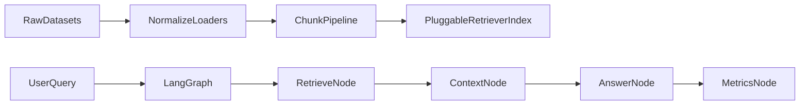

# LangGraph RAG Foundation

This project sets up a baseline Retrieval-Augmented Generation (RAG) system with a **LangGraph** execution flow focused on **HotpotQA**:

- [HotpotQA](https://huggingface.co/datasets/hotpotqa/hotpot_qa)

Milestone 1 scope is **foundation only**:

- dataset ingestion/normalization
- chunking
- index build
- retrieval + answer flow in LangGraph
- basic evaluation report generation

This milestone does **not** include retriever or generator fine-tuning.

## Architecture



## Project Layout

```text
src/
  config.py
  datasets/
    schema.py
    hotpot_hf_loader.py
    hotpot_loader.py
  processing/chunker.py
  indexing/bm25_store.py
  indexing/dense_lsa_store.py
  indexing/vector_store.py
  retrieval/retriever.py
  retrieval/plugins.py
  graph/rag_graph.py
  eval/metrics.py
  pipelines/
    build_index.py
    run_eval.py
tests/
  fixtures/
  test_loaders.py
  test_chunking.py
  test_graph_smoke.py
data/
  raw/
  processed/
  index/
```

## Setup

### 1) Create environment and install dependencies

```bash
python -m venv .venv
.venv\Scripts\activate
python -m pip install -r requirements.txt
```

### 2) Environment variables

Copy `.env.example` to `.env` and update if needed. Current defaults are enough for local baseline runs.

```bash
copy .env.example .env
```

## Dataset Preparation

Place dataset files in `data/raw/` (or pass absolute paths directly).

Expected file formats for this baseline:

- **HotpotQA via Hugging Face**: use `--hotpot-hf-config distractor|fullwiki`
- **HotpotQA local JSON**: records with `context` and `supporting_facts`

## Build the Index

Run with Hugging Face HotpotQA:

```bash
python -m src.pipelines.build_index \
  --hotpot-hf-config distractor \
  --retriever tfidf \
  --split train
```

If you prefer local Hotpot JSON instead of Hugging Face, replace `--hotpot-hf-config distractor` with:

```bash
--hotpot data/raw/hotpot_sample.json
```

You should see:

- index path
- record count
- chunk count

## Run Evaluation

Use a JSONL query file (`query`, optional `expected_answer`):

```bash
python -m src.pipelines.run_eval \
  --queries data/processed/sample_queries.jsonl \
  --output data/processed/eval_report.jsonl
```

Retriever plugin note:

- `--retriever` selects the retrieval backend plugin.
- `run_eval` can auto-detect plugin from index metadata if `--retriever` is omitted.
- Available plugins:
  - `tfidf`: sparse TF-IDF baseline
  - `bm25`: lexical BM25 retrieval
  - `dense_lsa`: lightweight dense semantic retrieval (TF-IDF + SVD)
  - `hybrid_rrf`: BM25 + TF-IDF fusion with reciprocal-rank fusion
  - `tfidf_rerank`: TF-IDF candidate retrieval + lexical reranking
  - `iterative_hybrid`: two-hop retrieval based on `hybrid_rrf`

Suggested starting point for HotpotQA:

- `--retriever hybrid_rrf` for stronger baseline quality
- `--retriever iterative_hybrid` for multi-hop oriented retrieval

Output rows include:

- `query`
- `expected_answer`
- `answer`
- `metrics` (`retrieved_count`, `answer_nonempty`, etc.)

## Test Commands

```bash
python -m pytest tests/test_loaders.py tests/test_chunking.py tests/test_graph_smoke.py tests/test_retriever_plugins.py
```

## Notes and Next Steps

### Current baseline decisions

- Retriever backends are plugin-based and local-first (no external vector DB required).
- Answer generation is deterministic and context-based (no paid LLM dependency required).

### Recommended Milestone 2

- Replace retrieval backend with dense embeddings + vector DB.
- Add reranking and query rewriting.
- Add LLM-based answer generation node.
- Introduce retriever training pipeline and benchmarking harness.

## Source References

- RAG tutorial overview and optimization path: [RAG 从零到一：构建你的第一个检索增强生成系统](https://www.cnblogs.com/informatics/p/19647478)
- HotpotQA dataset card: [hotpotqa/hotpot_qa](https://huggingface.co/datasets/hotpotqa/hotpot_qa)
